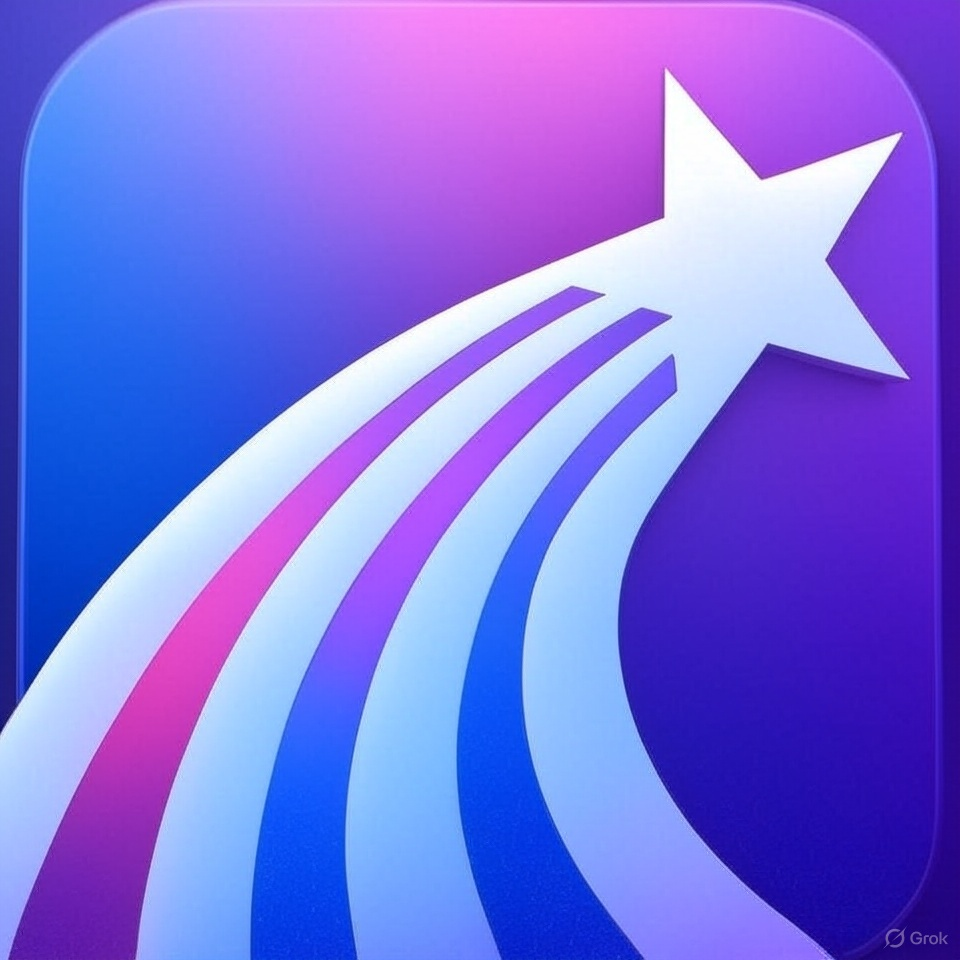

# OnlineTeach 📚

<div align="center">
  
  
  [](https://www.android.com)
  [](https://kotlinlang.org)
  [](https://material.io/design)
</div>

## 📱 项目简介

OnlineTeach 是一款仿学习通的在线教育应用，提供课程学习、社交互动、学习管理等功能。采用现代化的 Material Design 设计风格，为用户提供流畅的学习体验。

## ✨ 主要功能

### 📚 课程系统
- 课程列表展示与搜索
- 课程详情查看
- 课程报名与学习
- 课程进度跟踪

### 📅 学习管理
- 个人学习仪表盘
- 课程日历规划
- 学习备忘录
- 电子书书架

### 👥 社交互动
- 群组学习
- 实时聊天
- 消息通知
- 学习社区

## 🛠️ 技术栈

- **开发语言**: Java
- **UI框架**: Material Design
- **架构模式**: MVVM
- **数据存储**: Room Database
- **网络请求**: Retrofit
- **图片加载**: Glide
- **动画效果**: Lottie

## 📦 项目结构

```
OnlineTeach/
├── app/
│   ├── src/
│   │   ├── main/
│   │   │   ├── java/
│   │   │   │   └── com.example.onlineteach/
│   │   │   │       ├── data/           # 数据层
│   │   │   │       ├── ui/             # 界面层
│   │   │   │       └── utils/          # 工具类
│   │   │   └── res/                    # 资源文件
│   │   └── test/                       # 测试代码
│   └── build.gradle.kts                # 应用配置
└── build.gradle.kts                    # 项目配置
```

## 🎨 界面预览

### 主要界面
- 首页
- 课程列表
- 课程详情
- 学习仪表盘
- 群组聊天
- 个人中心
- ai悬浮球

## 🚀 开发环境

- Android Studio Hedgehog | 2023.1.1
- JDK 17
- Android SDK 34
- Gradle 8.2

## 📝 开发规范

- 遵循 Material Design 设计规范
- 使用 MVVM 架构模式
- 采用 ViewBinding 进行视图绑定
- 使用 Navigation 组件进行导航管理
- 遵循 Android 开发最佳实践

## 🔄 更新日志

### v1.1  (2024-5-31)
- 初始版本发布
- 实现基础功能模块
- 完成核心界面开发

## 🤝 贡献指南

1. Fork 本仓库
2. 创建新的功能分支
3. 提交您的更改
4. 发起 Pull Request

## 📄 开源协议

本项目采用 [MIT](LICENSE) 协议

## 👨‍💻 作者

- **gyf** - *Initial work* - [my GitHub](https://github.com/tonygyf)

## 🙏 致谢

- 感谢所有贡献者的付出
- 特别感谢开源社区的支持
- 感谢 Material Design 提供的设计规范

---

<div align="center">
  <sub>Built with ❤️ by gyf</sub>
</div>


          


    
